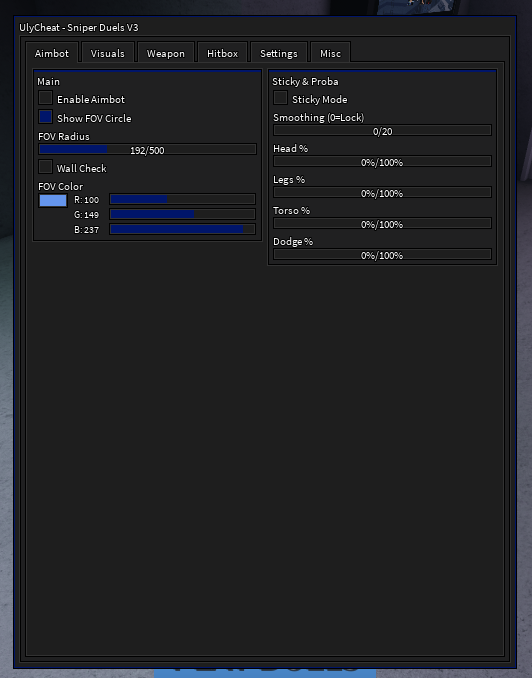
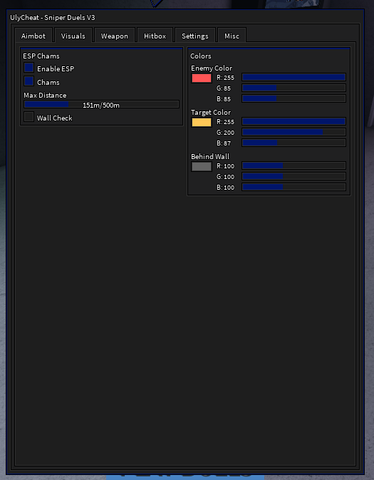
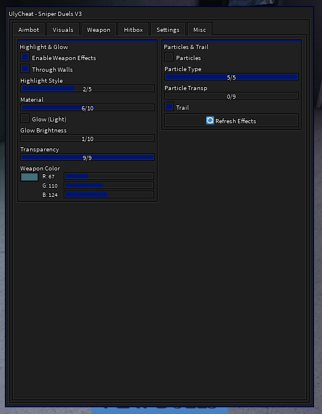
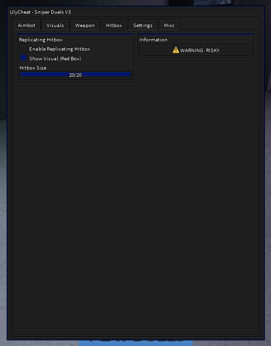

# 🎯 UlyCheat - Sniper Duels V3

<div align="center">


**Le cheat ultime pour Sniper Duels sur Roblox**

[🔗 Discord](https://discord.gg/uHYmwnA4rd) • [📥 Installation](#-installation) • [⌨️ Contrôles](#%EF%B8%8F-contrôles)

</div>

---

## 📋 Table des matières

- [✨ Fonctionnalités](#-fonctionnalités)
- [📸 Aperçus](#-aperçus)
- [📥 Installation](#-installation)
- [⌨️ Contrôles](#%EF%B8%8F-contrôles)
- [⚙️ Configuration](#%EF%B8%8F-configuration)
- [❓ FAQ](#-faq)
- [📞 Support](#-support)

---

## ✨ Fonctionnalités

### 🎯 Aimbot
| Fonctionnalité | Description |
|----------------|-------------|
| **Enable Aimbot** | Active/désactive l'aimbot |
| **FOV Circle** | Affiche un cercle de visée personnalisable (rayon 50-500px) |
| **FOV Color** | Couleur du cercle FOV personnalisable |
| **Wall Check** | Ne vise que les joueurs visibles (pas à travers les murs) |
| **Sticky Mode** | Reste verrouillé sur la même cible jusqu'à sa mort |
| **Smoothing** | Lissage de la visée (0 = lock parfait instantané) |

#### 🎲 Système de Probabilités Anti-Détection
| Cible | Description |
|-------|-------------|
| **Head %** | Pourcentage de chance de viser la tête |
| **Legs %** | Pourcentage de chance de viser les jambes |
| **Torso %** | Pourcentage de chance de viser le torse |
| **Dodge %** | Pourcentage de chance de NE PAS viser (évitement) |

> 💡 Ce système rend votre gameplay plus naturel et moins détectable !

---

### 👁️ ESP / Visuals
| Fonctionnalité | Description |
|----------------|-------------|
| **Enable ESP** | Active les effets visuels sur les joueurs |
| **Chams** | Highlight coloré sur les ennemis |
| **Max Distance** | Distance maximum d'affichage (10-500m) |
| **Wall Check** | Couleur différente pour les joueurs derrière les murs |

#### 🎨 Couleurs personnalisables
- **Enemy Color** - Couleur des ennemis
- **Target Color** - Couleur de la cible actuelle
- **Behind Wall** - Couleur des joueurs derrière les murs

---

### 🔫 Weapon Chams
| Fonctionnalité | Description |
|----------------|-------------|
| **Enable Weapon Effects** | Active les effets sur votre arme |
| **Through Walls** | Arme visible à travers les murs |
| **Highlight Style** | Style du highlight (OFF, Solid, Outline, Glass, Glow, Full) |
| **Material** | Matériau de l'arme (Neon, Glass, ForceField, Diamond, Ice, etc.) |
| **Glow** | Effet de lumière autour de l'arme |
| **Glow Brightness** | Intensité de la lumière (1-10) |
| **Transparency** | Transparence de l'arme (0-9) |
| **Weapon Color** | Couleur des effets |

#### ✨ Effets de Particules
| Type | Description |
|------|-------------|
| **Sparkles** | Étincelles brillantes |
| **Fire** | Flammes colorées |
| **Smoke** | Fumée stylisée |
| **Particles** | Particules flottantes |
| **Stars** | Étoiles lumineuses |

- **Trail** - Traînée derrière l'arme lors des mouvements

---

### 📦 Replicating Hitbox
| Fonctionnalité | Description |
|----------------|-------------|
| **Enable Hitbox** | Agrandit la hitbox des ennemis |
| **Show Visual** | Affiche un cube rouge autour des hitboxes |
| **Hitbox Size** | Taille de la hitbox (2-20) |

> ⚠️ **ATTENTION**: Cette fonctionnalité modifie les parts ennemies côté client. Utilisez avec prudence !

---

### ⚙️ Settings
| Fonctionnalité | Description |
|----------------|-------------|
| **Accent Color** | Couleur principale de l'interface |
| **Background Color** | Couleur de fond du menu |
| **Text Color** | Couleur du texte |

---

### 💾 Configuration
- **Sauvegarde automatique** toutes les 30 secondes
- **Sauvegarde manuelle** disponible
- **Chargement** de la configuration
- **Réinitialisation** aux valeurs par défaut

---

## 📸 Aperçus

<div align="center">

### 🎯 Aimbot


### 👁️ Visuals / ESP


### 🔫 Weapon Chams


### 📦 Hitbox


</div>

---

## 📥 Installation

### Prérequis
- Un **executor Roblox** supportant la Drawing Library :
  - ✅ Synapse X
  - ✅ Script-Ware
  - ✅ Fluxus
  - ✅ KRNL
  - ✅ Hydrogen
  - ✅ Wave

### Étapes

1. **Ouvrir** Roblox et lancer **Sniper Duels**
2. **Injecter** votre executor
3. **Exécuter** le script :

```lua
loadstring(game:HttpGet("VOTRE_LIEN_RAW"))()
```

Ou copier/coller le contenu de `main.lua` directement.

4. **Appuyer sur F2** pour ouvrir le menu

---

## ⌨️ Contrôles

| Touche | Action |
|--------|--------|
| `F2` | Ouvrir / Fermer le menu |
| `F3` | Activer / Désactiver l'Aimbot rapidement |
| `Clic Gauche` | Viser + Tirer (active l'aimbot) |
| `Clic Droit` | Reset la cible actuelle |

---


## ❓ FAQ

<details>
<summary><b>Le menu ne s'affiche pas ?</b></summary>

Votre executor ne supporte probablement pas la **Drawing Library**. Essayez un autre executor comme Solara ou Xeno.
</details>

<details>
<summary><b>L'aimbot ne fonctionne pas ?</b></summary>

1. Vérifiez que l'aimbot est **activé** (F3 ou dans le menu)
2. Vérifiez que le **FOV** est assez grand
3. Vérifiez que **Wall Check** n'est pas activé si vous êtes derrière un mur
</details>

<details>
<summary><b>Les effets d'arme ne marchent pas ?</b></summary>

1. Assurez-vous d'avoir une **arme équipée**
2. Cliquez sur **🔄 Refresh Effects** dans le menu Weapon
</details>

<details>
<summary><b>Comment être moins détectable ?</b></summary>

1. Utilisez le système de **probabilités** (Dodge % élevé)
2. Activez le **Smoothing** (valeur > 0)
3. Évitez le **Replicating Hitbox** en compétitif
</details>

---

## 🔧 Fonctionnalités Techniques

- ✅ **Drawing Library** - Interface fluide et moderne
- ✅ **Menu Draggable** - Déplacez le menu où vous voulez
- ✅ **Curseur Custom** - Curseur triangulaire stylisé
- ✅ **Notifications** - Retours visuels pour chaque action
- ✅ **Auto-Save** - Sauvegarde automatique toutes les 30s
- ✅ **Cleanup Automatique** - Nettoyage des objets à la déconnexion
- ✅ **Error Handling** - Gestion des erreurs avec pcall()

---

## 📞 Support

<div align="center">

[](https://discord.gg/uHYmwnA4rd)

**Besoin d'aide ? Rejoignez notre Discord !**

</div>

---


<div align="center">

**Made with ❤️ by UlyCheat**


</div>